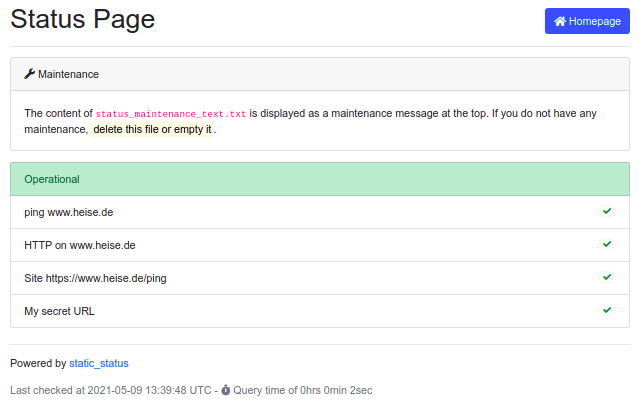

forked from (<https://github.com/Cyclenerd/static_shell>).

# status.sh

Simple Bash script to generate a static status page. Displays status of websites, services (HTTP, SAP, MySQL...) and ping. Everything easy to customize. 🤓

You can also easily check more complicated things with this script.
For example if a text is present in a web page or if a host appears in the route path (traceroute).
Checking the route path is useful, for instance, if you have a backup mobile internet connection in addition to your cable connection or selective vpn routing.

This fork has a different file and folder arrangement, an addition of a traceroutevpn command (that can check the route to a second ip address) and different css for the icons used in the html page.


## Installation

Clone the repo

Create a file called `cfg/status_hostname_list.txt` with details of the checks to be performed. This can be done by copying the `cfg/status_hostname_list-example.txt` file. The script will work immediately and will use example configuration.

### Optional

Copy the file called `cfg/config-example` as `cfg/config` and edit the variables as required.

Places scripts in the `cfg/scripts` folder.

### Run

```shell
bash "status.sh"
```

## Usage

```text
Usage: status.sh [OPTION]:
	OPTION is one of the following:
		silent	 no output from faulty connections to stout (default: no)
		loud	 output from successful and faulty connections to stout (default: no)
		help	 displays help (this message)
```

Example:

```shell
bash "status.sh" loud
```

Execute a cron job every minute:

```shell
crontab -e
```

Add:

```
*/1 * * * * bash "/path/to/status.sh" silent >> /dev/null
```

The files created by the script will be written to the `output` folder (unless changed in the `cfg/config-example` file or - if created - the `cfg/config` file).

### Screenshots




## Custom Text

You can display a custom text instead of the HOSTNAME/IP/URL (see example below).


status_hostname_list.txt:

```csv
ping;192.168.100.1|<a href="http://192.168.100.1/">Orbi</a>
ping;192.168.100.102|Wohnzimmer
ping;192.168.221.1|pfSense
ping;192.168.211.1|DSL Fritz Box
ping;192.168.212.1|LTE Fritz Box
ping;192.168.211.80|Synology Keller
ping;8.8.8.8|Google DNS
nc;192.168.100.1|DNS @ Orbi;53
nc;192.168.221.1|DNS @ pfSense;53
nc;192.168.211.1|DNS @ DSL Fritz Box;53
nc;8.8.8.8|DNS @ Google;53
curl;http://www.heise.de/ping|www.heise.de
traceroute;192.168.211.1|DSL Internet;3
```

## Requirements

Only `bash`, `ping`, `traceroute`, `curl`, `nc`, `grep` and `sed`.
In many *NIX distributions (Ubuntu, macOS) the commands are already included.
If not, the missing packages can be installed quickly.

On a debian-based system (Ubuntu), just run:

```shell
sudo apt install curl iputils-ping traceroute netcat-openbsd grep sed
```

## TODO

* More and better documentation - new traceroutevpn command 
* update screenshots
* create dockerfile for running in a container

Help is welcome 👍


## License

GNU Public License version 3.
Please feel free to fork and modify this on GitHub (<https://github.com/Cyclenerd/static_shell>).
